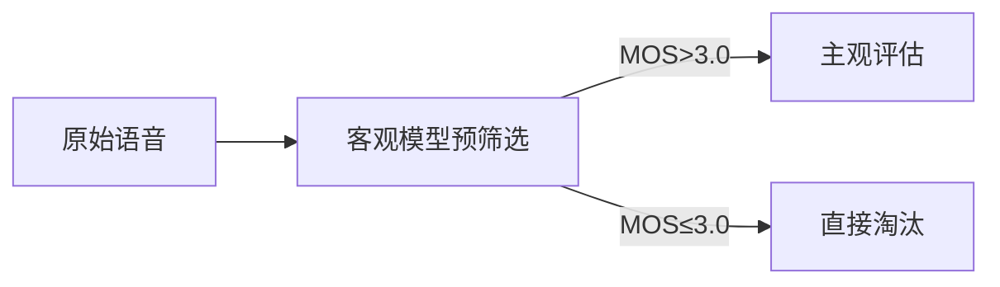

平均意见分（Mean Opinion Score, MOS）是语音质量评估的黄金标准，但不同条件下MOS值可能存在显著差异。以下是导致MOS值差异的关键因素、量化分析方法及解决方案的详细解析：

### **1. MOS值差异的核心原因**

#### **(1) 主观评估因素**

| 因素                | 影响描述                                                                 | 示例                                                                 |
|---------------------|--------------------------------------------------------------------------|----------------------------------------------------------------------|
| **听音人群体差异**  | 年龄、听力敏感度、语言背景不同导致评分偏差                              | 老年人对高频失真更敏感                                              |
| **测试环境**        | 安静实验室 vs 嘈杂环境下的评分差异                                      | 背景噪声50dB时MOS可能下降0.5-1.0                                    |
| **心理量表设计**    | 5级制（1-5分） vs 连续量表（0-100）的评分分布差异                       | ITU-T P.800标准要求5级制                                           |
| **疲劳效应**        | 长时间测试导致听音人注意力下降                                          | 后30个样本的评分比前30个系统性低0.2分                              |

#### **(2) 客观系统差异**

| 因素                | 影响描述                                                                 | 示例                                                                 |
|---------------------|--------------------------------------------------------------------------|----------------------------------------------------------------------|
| **编解码器类型**    | 不同编码算法（如G.711 vs Opus）的失真特性不同                           | 低比特率Opus在8kbps时MOS比AMR高0.8分                               |
| **网络损伤**        | 丢包、抖动、延迟对语音质量的影响                                        | 5%丢包率可能导致MOS下降1.5分                                       |
| **语音增强算法**    | 降噪、回声消除等处理可能引入新失真                                      | 激进降噪算法可能提升SNR但降低MOS 0.3分（语音自然度下降）            |

#### **(3) 测试方法差异**

| 测试类型            | 特点                                                                     | MOS差异范围                         |
|---------------------|--------------------------------------------------------------------------|-------------------------------------|
| **绝对评分（ACR）** | 单独评估单个样本                                                         | 样本间差异可达1.5分                |
| **对比评分（CCR）** | 直接比较参考样本和待测样本                                               | 差异更显著（如-2~+2分制）          |
| **隐藏参考（MUSHRA）** | 专业听音人评估，包含隐藏参考信号                                       | 高分辨率（0-100分）                |

### **2. MOS差异的量化分析方法**

#### **(1) 统计检验方法**

- **T检验/ANOVA**：判断两组MOS均值差异是否显著（p<0.05）。  
  ```python
  from scipy import stats
  # 假设group1和group2为两组MOS评分
  t_stat, p_value = stats.ttest_ind(group1, group2)
  print(f"p-value: {p_value:.4f}")  # p<0.05表示差异显著
  ```
- **Cohen's d效应量**：量化差异幅度：  
  \[
  d = \frac{\bar{X}_1 - \bar{X}_2}{s_{\text{pooled}}}
  \]  
  - \(d>0.8\)为**大效应**，\(d<0.2\)可忽略。

#### **(2) 可视化分析**

- **箱线图**：展示分布中位数、四分位数及离群点。  
  ```python
  import matplotlib.pyplot as plt
  plt.boxplot([group1, group2], labels=['Group1', 'Group2'])
  plt.ylabel('MOS')
  plt.show()
  ```
- **MOS分布直方图**：检查评分偏态（如天花板效应）。  

#### **(3) 客观-主观相关性分析**

- **Pearson相关系数（r）**：评估客观模型（如PESQ、POLQA）与MOS的相关性。  
  - \(r>0.9\)：强相关；\(r<0.6\)：模型不可靠。

### **3. 典型场景下的MOS差异案例**

#### **案例1：编解码器对比**

| 编解码器 | 比特率 | MOS（安静） | MOS（噪声） | 差异原因               |
|----------|--------|-------------|-------------|------------------------|
| G.711    | 64kbps | 4.2         | 3.8         | 无压缩但对噪声敏感     |
| Opus     | 16kbps | 4.0         | 3.9         | 抗噪声编码优化         |
| AMR-NB   | 12.2kbps | 3.5       | 2.7         | 低比特率下语音失真大   |

#### **案例2：语音增强前后**

| 算法       | SNR提升 | MOS变化 | 关键问题                     |
|------------|---------|---------|------------------------------|
| 谱减法     | +10dB   | -0.2    | 引入"音乐噪声"               |
| 深度学习降噪 | +15dB   | +0.5    | 更好保留语音自然度           |

### **4. 减少MOS差异的解决方案**

#### **(1) 标准化测试流程**

- **遵循ITU-T标准**：  
  - P.800（主观测试方法）  
  - P.863（POLQA客观模型）  
- **控制环境变量**：  
  - 背景噪声<30dB(A)  
  - 使用校准耳机（如Sennheiser HD650）

#### **(2) 数据增强与平衡**

- **人群分层抽样**：按年龄、性别均衡分配听音人。  
- **对抗样本训练**：提升客观模型在极端条件下的鲁棒性。

#### **(3) 混合评估策略**


> **注**：先用POLQA/PESQ过滤低质量样本，再投入昂贵的主观测试。

### **5. 前沿进展**

- **深度学习MOS预测**：  
  - **NISQA**：基于CNN-LSTM的端到端MOS预测模型（RMSE=0.5）。  
  - **SERFAQ**：结合语音识别错误率的联合评估。  
- **众包MOS平台**：  
  - **Amazon Mechanical Turk**：需严格质量控制（如黄金样本检测）。

### **6. 关键结论**
- **允许差异范围**：同一系统重复测试MOS波动±0.2分属正常。  
- **显著差异阈值**：≥0.5分需分析技术或方法学原因。  
- **终极解决方案**：主观评估+客观模型+听觉场景分析（如AI合成语音需特殊评估准则）。  

通过系统化控制测试变量、采用混合评估方法，可有效降低MOS差异，提升语音质量评估的可靠性和可重复性。